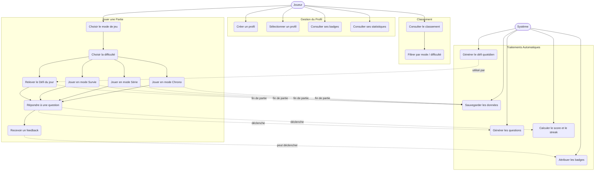

# Diagramme de Cas d'Utilisation — Jeu de Calcul Mental

---

## Tableau des cas d'utilisation

### Acteurs

| Acteur | Rôle |
|--------|------|
| **Joueur** | Utilisateur principal — interagit avec l'interface |
| **Système** | Traite automatiquement les données en arrière-plan |

---

### Cas d'utilisation détaillés

#### Gestion du Profil

| ID | Cas d'utilisation | Acteur | Description |
|----|-------------------|--------|-------------|
| UC1 | Créer un profil | Joueur | Saisir un pseudo, initialiser les stats et badges |
| UC2 | Sélectionner un profil | Joueur | Choisir un profil existant au démarrage |
| UC3 | Consulter ses badges | Joueur | Voir les badges obtenus et ceux à débloquer |
| UC4 | Consulter ses statistiques | Joueur | Voir précision, meilleurs scores, opérations fortes/faibles |

#### Jouer une Partie

| ID | Cas d'utilisation | Acteur | Description |
|----|-------------------|--------|-------------|
| UC5 | Choisir le mode de jeu | Joueur | Sélectionner Chrono, Série, Survie ou Défi du jour |
| UC6 | Choisir la difficulté | Joueur | Sélectionner Facile, Moyen ou Difficile |
| UC7 | Jouer en mode Chrono | Joueur | Répondre au maximum en 60 secondes |
| UC8 | Jouer en mode Série | Joueur | Répondre à 10, 20 ou 30 questions sans limite de temps |
| UC9 | Jouer en mode Survie | Joueur | Jouer avec 3 vies, chaque erreur en retire une |
| UC10 | Relever le Défi du jour | Joueur | Jouer le défi unique du jour, jouable une seule fois |
| UC11 | Répondre à une question | Joueur | Saisir la réponse à une opération affichée |
| UC12 | Recevoir un feedback | Joueur | Voir si la réponse est correcte et la correction si besoin |

#### Classement

| ID | Cas d'utilisation | Acteur | Description |
|----|-------------------|--------|-------------|
| UC13 | Consulter le classement | Joueur | Voir le top 10 des meilleurs scores |
| UC14 | Filtrer par mode / difficulté | Joueur | Affiner le classement selon le mode et le niveau |

#### Traitements Automatiques (Système)

| ID | Cas d'utilisation | Acteur | Description |
|----|-------------------|--------|-------------|
| UC15 | Générer les questions | Système | Créer des opérations aléatoires selon le niveau choisi |
| UC16 | Calculer le score et le streak | Système | Mettre à jour le score en temps réel avec bonus de série |
| UC17 | Attribuer les badges | Système | Vérifier et débloquer les badges après chaque partie |
| UC18 | Sauvegarder les données | Système | Écrire profil, session et scores en JSON à la fin de chaque partie |
| UC19 | Générer le défi quotidien | Système | Produire un défi identique pour tous via un seed basé sur la date |

---

## Règles métier importantes

- **Divisions** : le résultat est toujours un entier (ex : 8 ÷ 4, jamais 7 ÷ 3).
- **Soustractions Facile** : le résultat est toujours ≥ 0 (le plus grand nombre est toujours en premier).
- **Défi du jour** : généré à partir de la date comme seed aléatoire — même questions pour tous les joueurs ce jour-là, jouable une seule fois par profil.
- **Streak** : le bonus de série s'accumule à chaque bonne réponse consécutive et se remet à zéro à la première erreur.
