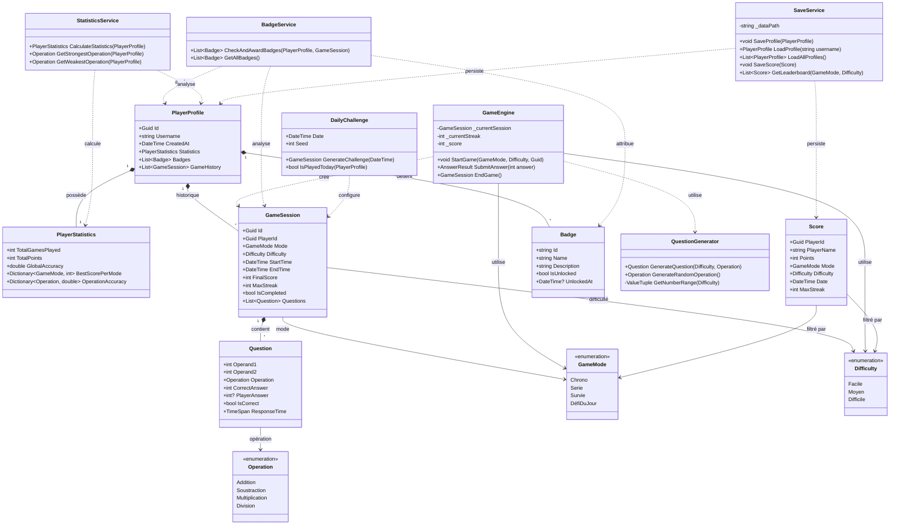

# Diagramme de Classes — Jeu de Calcul Mental

## Légende

| Symbole | Signification |
|---------|---------------|
| `*--`   | Composition (l'enfant ne peut exister sans le parent) |
| `o--`   | Agrégation (relation forte mais indépendante) |
| `..>`   | Dépendance (utilisation temporaire) |
| `-->`   | Association (lien direct) |
| `<<enumeration>>` | Type énuméré |

## Description des classes principales

### Modèles
- **PlayerProfile** : profil complet du joueur, point central des données.
- **PlayerStatistics** : agrège toutes les métriques calculées d'un joueur.
- **GameSession** : une partie complète, avec toutes ses questions et son score final.
- **Question** : une question posée, avec la réponse du joueur et le temps de réponse.
- **Score** : entrée de classement, indépendante du profil pour les requêtes rapides.
- **Badge** : récompense débloquée selon les accomplissements.

### Services
- **QuestionGenerator** : génère des questions selon le niveau et l'opération, garantit les règles (division entière, soustraction ≥ 0).
- **GameEngine** : orchestre une partie en temps réel (score, streak, timer, vies).
- **SaveService** : sérialise/désérialise toutes les données en JSON local.
- **BadgeService** : vérifie les conditions de déblocage après chaque partie.
- **StatisticsService** : calcule les statistiques à partir de l'historique.
- **DailyChallenge** : génère un défi reproductible via un seed basé sur la date.
